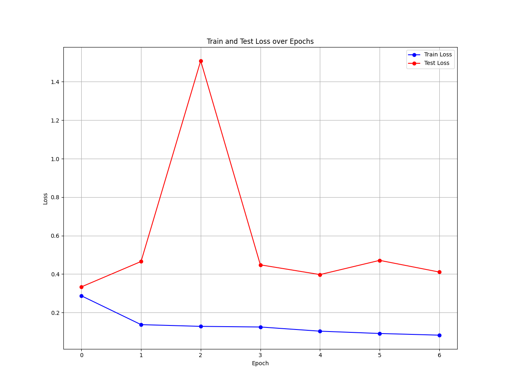

# CNN X-RAY
Цель данного проекта спроектировать собственную CNN (свёрточную нейронную сеть) сложностью сопоставимой с известной моделью компьютерного зрения YOLOv11
(small архитектура) и сравнить работу двух моделей в задаче бинарной классификации.

## Используемые библиотеки
- sklearn
- matplotlib
- numpy
- torch (2.6.0)
- tqdm
- ultralytics

## Структура проекта
- scripts/
	- custom/
		- `train.py`: содержит класс модели и цикл её обучения;
		- `evaluate.py`: рассчитывает показатели качества (метрики) модели
						 и находит оптимальный порог (threshold) классификации;
	- yolo/
		- `train.py`: содержит инициализацию обучения модели;
		- `eval.py`: рассчитывает показатели качества (метрики) модели
					 и находит оптимальный порог классификации;
- dataset/\
    Содержит наборы обучающих и тестовых изображений.
- models/
	- custom model weights/\
		Содержит параметры моей обученной модели;
	- yolo weights/\
		Содержит предобученню стандартную модель yolo11s-cls.pt и обученную модель best.pt;
		
## Информация об обучающих данных
Обучающие и тестовые данные представляют из себя рентгеновские снимки здоровых и больных пациентов. Размеры изображений разнятся. Классы несбалансированы.
В обучающем наборе 5232 изображений, в тестовом - 624. Датасет взят с сайта Kaggle (https://www.kaggle.com/datasets/tolgadincer/labeled-chest-xray-images).

## Информация о моей модели
**Количество параметров модели:**\
10,357,346

**Архитектура модели:**
- 5 свёрточных слоёв + нормализация батча + дропаут
- Два скрытых слоя по 1024 и 512 нейронов соответственно + дропаут\
Подробнее об архитектуре модели можно увидеть в комментариях к классу модели scripts/custom/train.py

**Обучение:**\
Модель обучалась в течение 7 эпох.

## Информация о модели YOLO
**Количество параметров модели yolo11s-cls:**\
10,400,000

**Обучение:**\
Модель обучалась в течение 10 эпох со стандартными параметрами обучения.

## Метрики моделей
**YOLO:**\
Оптимальный порог классификации: 0.7280\
Accuracy: 0.9840\
Precision: 0.9822\
Recall: 0.9923\
F1-score: 0.9872\
Confusion Matrix:\
[[227   7]\
 [  3 387]]

 
**Моя модель:**\
Оптимальный порог классификации: 0.4263\
Accuracy: 0.8413\
Precision: 0.8557\
Recall: 0.8974\
F1-score: 0.8761\
Confusion Matrix:\
[[175  59]\
 [ 40 350]]

Как можно было бы улучшить качество моей модели:
использовать более эффективную архитектуру сети, добавить побольше аугментации, поработать с балансом классов.
